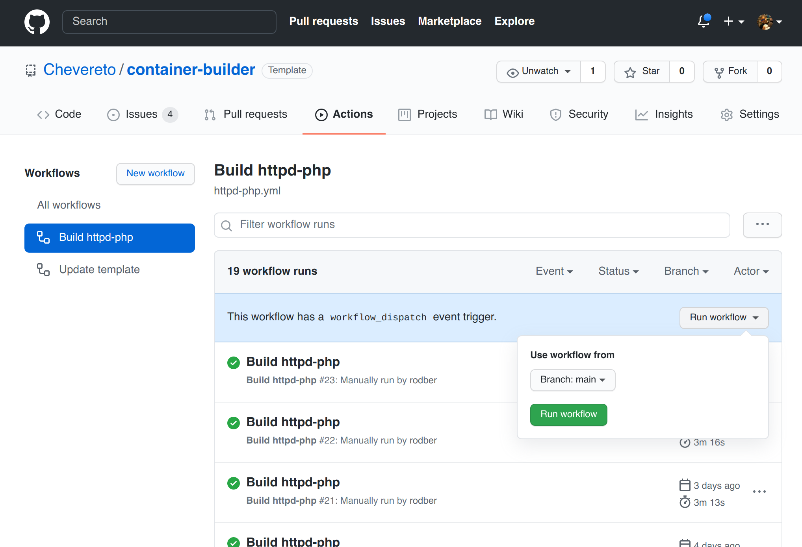
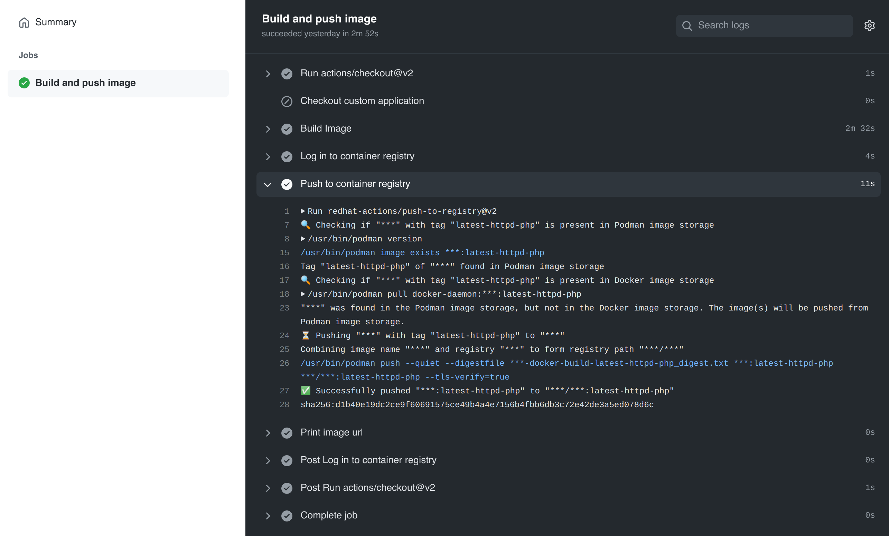

# Building

The build process consist in build the container image that you will use to deploy your container instances.

1. Go to **Actions**
2. Select the target **Build** under **Workflows**
3. Click on **Run Workflow** and confirm



✅ When done **the build will be available** at your target container registry.



## Manual building

```sh
docker build -t tag . -f httpd-php.Dockerfile --build-arg CHEVERETO_LICENSE=<license>
```
