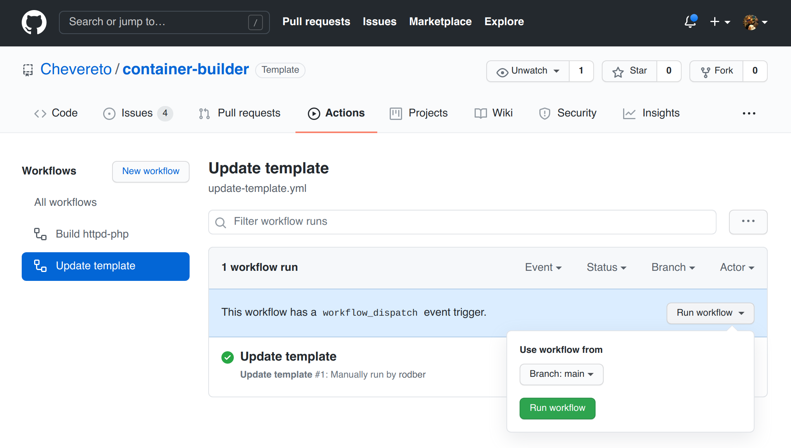
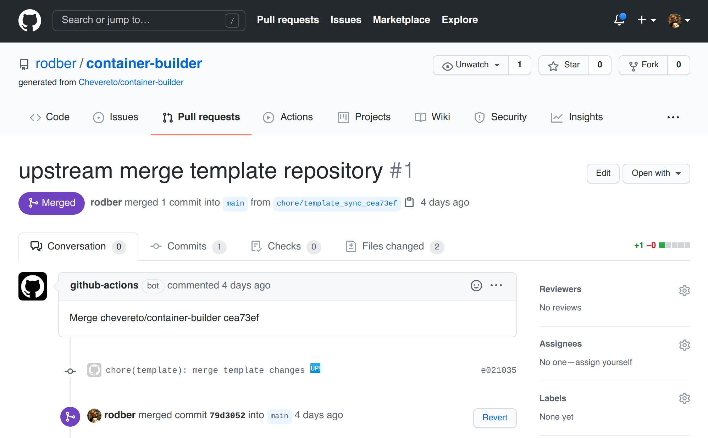

# Updating

The update process consist in that you pull our `chevereto/container-builder` repo changes for updating the Dockerfile. From there you can re-build the image, with the updated changes.

## One-click updating

1. Go to **Actions**
2. Select **Update template** under **Workflows**
3. Click on **Run Workflow** and confirm



🤖 When done **a bot will create a pull request** in your repo so you can review and confirm the changes.



## Manual updating

* Add the main template repository as remote `template`. This is required just once.
  
```sh
git remote add template https://github.com/chevereto/container-builder 
```

* Fetch `template` and merge it with `main`. This will pull all updates.

```sh
git fetch template main
git merge template/main --allow-unrelated-histories
```

* When done push the changes to your remote repository.

```sh
git push
```
