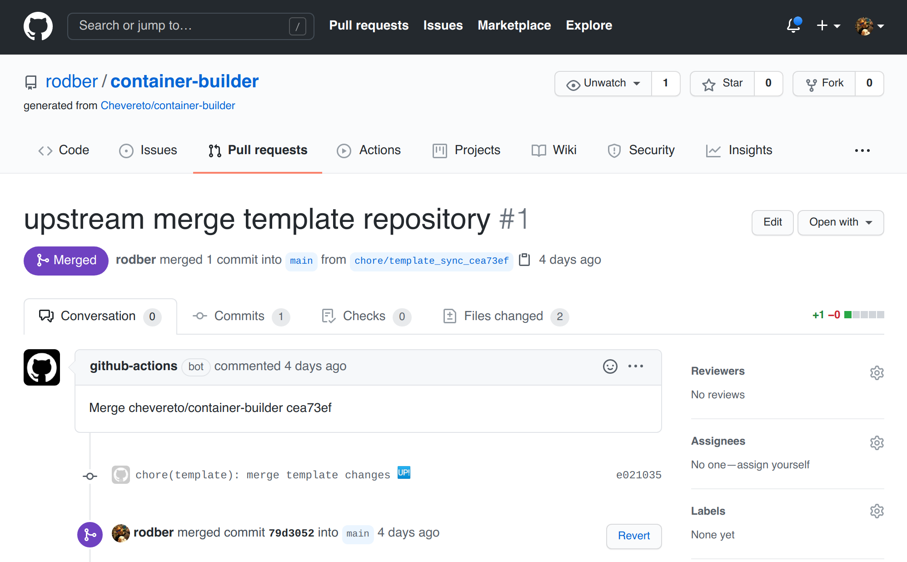

# Updating

## Repository update

To update your containers to the latest version of this repository make sure to run first:

```sh
make down
```

💡 If you forget to run this you can rollback the repo and execute the above command.

### Manual updating

Pull this updated repo changes in your fork.

```sh
git fetch --tags -f && git pull
```

### GitHub one-click updating

1. Go to **Actions**
2. Select **Update** under **Workflows**
3. Click on **Run Workflow** and confirm


🤖 When done **a bot will create a pull request** in your repo so you can review and confirm the changes.



## Chevereto application update

With the repository updated follow these steps:

1. Re-build the images (see [BUILDING](BUILDING.md))
2. Down containers (see [DOCKER-COMPOSE](DOCKER-COMPOSE.md#down))
3. [Re-up containers](DOCKER-COMPOSE.md#up-daemonized)

Refer to [persistance troubleshoot](PERSISTENT.md#no-persistence) If the system prompts to re-install.
